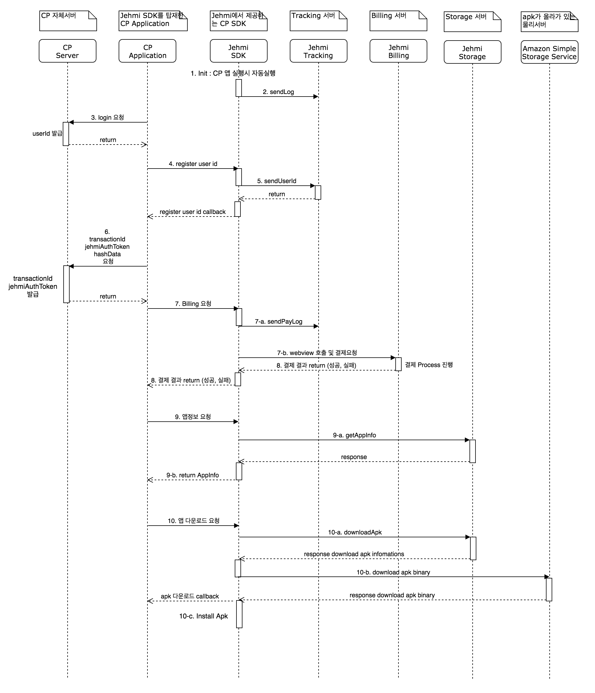

# contents-platform-sdk #
Jehmi Content Platform (이하 JCP)에서 제공하는 Tracking, Biiling API SDK 입니다.

## Android platform SDK
- 각 국가별 PG사 연동 지원 (Billing)
- 사용자 분석 제공 (Tracking)
- 사용자분석용 로깅은 성공과 실패에 영향을 받지 않는다.
- 등록된 앱에 대한 정보제공
- 최신버전의 apk다운로드및 자동설치 제공
## SDK에서 사용하는 퍼미션
- android.permission.INTERNET 
- android.permission.WRITE_EXTERNAL_STORAGE
- android.permission.READ_EXTERNAL_STORAGE
- android.permission.REQUEST_INSTALL_PACKAGES

## [samples](samples) ##
java, kotlin, unity, cocos2d-x 샘플이 제공됩니다.

* [cp-android-java](samples/cp-android-java)
* [cp-android-kotlin](samples/cp-android-kotlin)
* [cp-unity](samples/cp-unity)
* [cp-cocos](samples/cp-cocos)

## [archive](archive) ##
Gradle 프로젝트가 아닐 경우, 해당 라이브러리를 직접 프로젝트 내에 libs로 복사하여 사용하세요.

* common.aar
* cp.aar
* unitypackage
* cpp-bridge.zip

## API Flow

