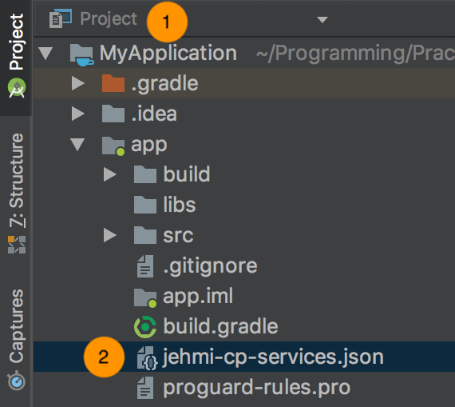

# Android CP SDK 설정 가이드
* CP API를 사용하기 위한 Android SDK 설정방법입니다.

#### 요구사항
* Minimum Android Version : Android 4.1 'Jelly Bean' (API level 16)
* instant Run 제거. (Preferences -> Instant Run -> Enable Instant Run 해제)

<!--
android_replace_001 : plugin version
android_replace_002 : sdk version
-->

#### Step 1. Project Gradle `<project>/build.gradle` 
```gradle
allprojects {
    repositories {
        maven { url 'http://nexus.jehmi.com/nexus/content/groups/public/' }
    }
    dependencies {
        classpath "com.jehmi:jehmi-cp-services:0.1.0"
    }
}
```

#### Step 2. App Gradle `<project>/<app-module>/build.gradle`
```gradle
dependencies {
    implementation 'com.jehmi:cp:0.1.0'
}
...
// Add to the bottom of the file
apply plugin: 'jehmi-cp-services'
```

#### Step 3. 구성파일 다운로드 및 설정
1. Android Studio에서 왼쪽상단 Project 보기로 설정하세요.
2. 위에서 다운로드한 `jehmi-cp-services.json` 을 `<project>/<app-module>` 에 추가합니다. 

