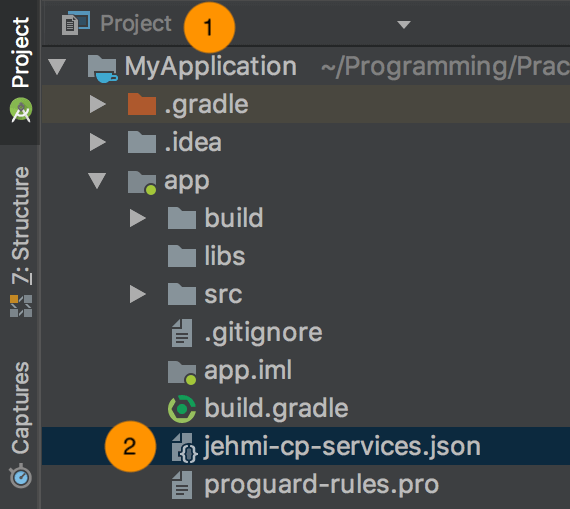

# Cocos2d-x CP SDK 설정 가이드
* Android Studio 용으로 SDK 를 가이드 합니다.

## Cocos2d-x
Cocos2d-x [다운로드](http://www.cocos2d-x.org/download/version#Cocos2d-x)를 한 후, [시작 가이드](http://cocos2d-x.org/docs/cocos2d-x/en/editors_and_tools/cocosCLTool.html)를 보면서 프로젝트를 구성할 수 있습니다.

#### Setup Cocos2d-x App
cocos2d-x 폴더를 이동하여 다음 명령을 실행해 프로젝트를 만듭니다.

```
cocos new {AppName} -p {PackageName} -l cpp -d ./{MyProjectDirectory}
```

Jehmi CP Cpp Bridge SDK 를 다운로드한 후 압축을 풀어서 프로젝트 폴더에 저장합니다.
```
cp -R {Download/jehmi-cp-sdk-cpp-bridge} {MyProject/jehmi-cp-sdk-cpp-bridge}
```


## Android

#### 요구사항
Minimum Android Version : Android 4.1 'Jelly Bean' (API level 16)
instant Run 제거. (Preferences -> Instant Run -> Enable Instant Run 해제)


#### Step 1. Project Gradle `<project>/build.gradle` 
```
allprojects {
    repositories {
        maven { url 'http://nexus.jehmi.com/nexus/content/groups/public/' }
    }
    dependencies {
        classpath "com.jehmi:jehmi-cp-services:0.1.0"
    }
}
```

#### Step 2. App Gradle `<project>/<app-module>/build.gradle`
```gradle
dependencies {
    implementation 'com.jehmi:cp:0.1.0'
}
...
// Add to the bottom of the file
apply plugin: 'jehmi-cp-services'
```

#### Step 3. 구성파일 다운로드 및 설정
1. Android Studio에서 왼쪽상단 Project 보기로 설정하세요.
2. 위에서 다운로드한 `jehmi-cp-services.json` 을 `<project>/<app-module>` 에 추가합니다. 



## JNI 빌드 설정
* ndk-build 와 cmake 빌드 방식 둘다 지원합니다.
* stl 은 gnustl C++ 라이브러리 만 지원합니다.

#### ndk-build
프로젝트 파일 패널의 app/jni 폴더에서 Application.mk를 엽니다.
* APP_STL 값은 gnustl_static 이나 gnustl_shared 를 사용해야 합니다.
```
APP_STL := gnustl_static
```

프로젝트 파일 패널의 app/jni 폴더에서 Android.mk를 엽니다. Jehmi Contents Platform Cpp SDK 경로를 다음과 같이 설정합니다.
```
LOCAL_PATH := $(call my-dir)
 
#
# jehmi-cp-sdk-cpp-bridge Shared Library
#
include $(CLEAR_VARS)
 
LOCAL_MODULE            := jehmi-cp-sdk-cpp-bridge
LOCAL_SRC_FILES         := $(LOCAL_PATH)/../../../jehmi-cp-sdk-cpp-bridge/libs/$(TARGET_ARCH_ABI)/libjehmi-cp-sdk-cpp-bridge.so
LOCAL_EXPORT_C_INCLUDES := $(LOCAL_PATH)/../../../jehmi-cp-sdk-cpp-bridge/includes
 
include $(PREBUILT_SHARED_LIBRARY)
 
include $(CLEAR_VARS)
 
...
...
 
# _COCOS_HEADER_ANDROID_BEGIN
# _COCOS_HEADER_ANDROID_END
 
LOCAL_STATIC_LIBRARIES := cocos2dx_static
LOCAL_SHARED_LIBRARIES := jehmi-cp-sdk-cpp-bridge
 
# _COCOS_LIB_ANDROID_BEGIN
# _COCOS_LIB_ANDROID_END
```

#### cmake
프로젝트 폴더 내의  CMakeLists.txt 파일에 아래 내용을 추가하세요.
```
# jehmi-cp-sdk-cpp-bridge

set(JEHMI_LIBS_DIR ${CMAKE_CURRENT_SOURCE_DIR}/jehmi-cp-sdk-cpp-bridge)

include_directories(${JEHMI_LIBS_DIR}/includes)

add_library(jehmi-cp-sdk-cpp-bridge
                SHARED
                IMPORTED)

set_target_properties(jehmi-cp-sdk-cpp-bridge
                        PROPERTIES IMPORTED_LOCATION
                        ${JEHMI_LIBS_DIR}/libs/${ANDROID_ABI}/libjehmi-cp-sdk-cpp-bridge.so)

#target_link_libraries(${APP_NAME} jehmi-cp-sdk-cpp-bridge)

...
...

cocos_build_app(${APP_NAME}
                APP_SRC "${APP_SRC}"
                DEPEND_COMMON_LIBS "cocos2d"
                DEPEND_ANDROID_LIBS "cocos2d_android" "jehmi-cp-sdk-cpp-bridge"
)

...
```

모듈의 build.gradle 에 아래와 같이 설정하세요.
```
android {
    ...
    defaultConfig {
        externalNativeBuild {
            if (PROP_BUILD_TYPE == 'ndk-build') {
                ndkBuild {
                    targets 'MyGame'
                    arguments 'NDK_TOOLCHAIN_VERSION=clang'
                    arguments '-j' + Runtime.runtime.availableProcessors()
                }
            }
            else if (PROP_BUILD_TYPE == 'cmake') {
                cmake {
                    targets 'MyGame'
                    arguments "-DCMAKE_FIND_ROOT_PATH=", "-DANDROID_STL=gnustl_static", "-DANDROID_TOOLCHAIN=clang", "-DANDROID_ARM_NEON=TRUE", \
                        "-DUSE_CHIPMUNK=TRUE", "-DUSE_BULLET=TRUE"
                    cppFlags "-frtti -fexceptions"
                }
            }
        }

        ndk {
            abiFilters=[]
            abiFilters.addAll(PROP_APP_ABI.split(':').collect{it as String})
            stl 'gnustl_static'
        }
    }

    sourceSets.main {
        java.srcDir "src"
        res.srcDir "res"
        manifest.srcFile "AndroidManifest.xml"
        assets.srcDir "../../Resources"

        if (PROP_BUILD_TYPE == 'cmake') {
            jniLibs.srcDirs = ['../../jehmi-cp-sdk-cpp-bridge/libs']
        }
    }

    externalNativeBuild {
        if (PROP_BUILD_TYPE == 'ndk-build') {
            ndkBuild {
                path "jni/Android.mk"
            }
        }
        else if (PROP_BUILD_TYPE == 'cmake') {
            cmake {
                path "../../CMakeLists.txt"
            }
        }
    }
    ...
}
...
```
