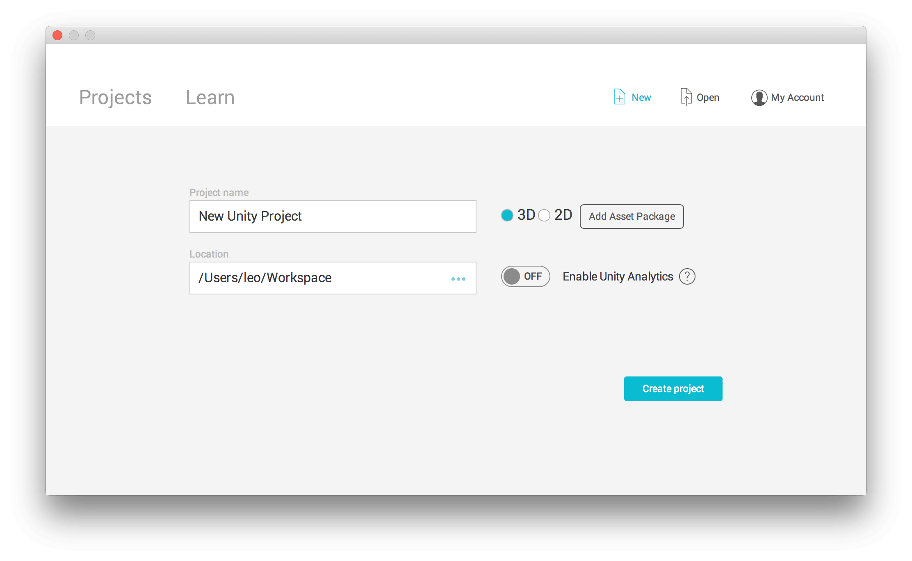
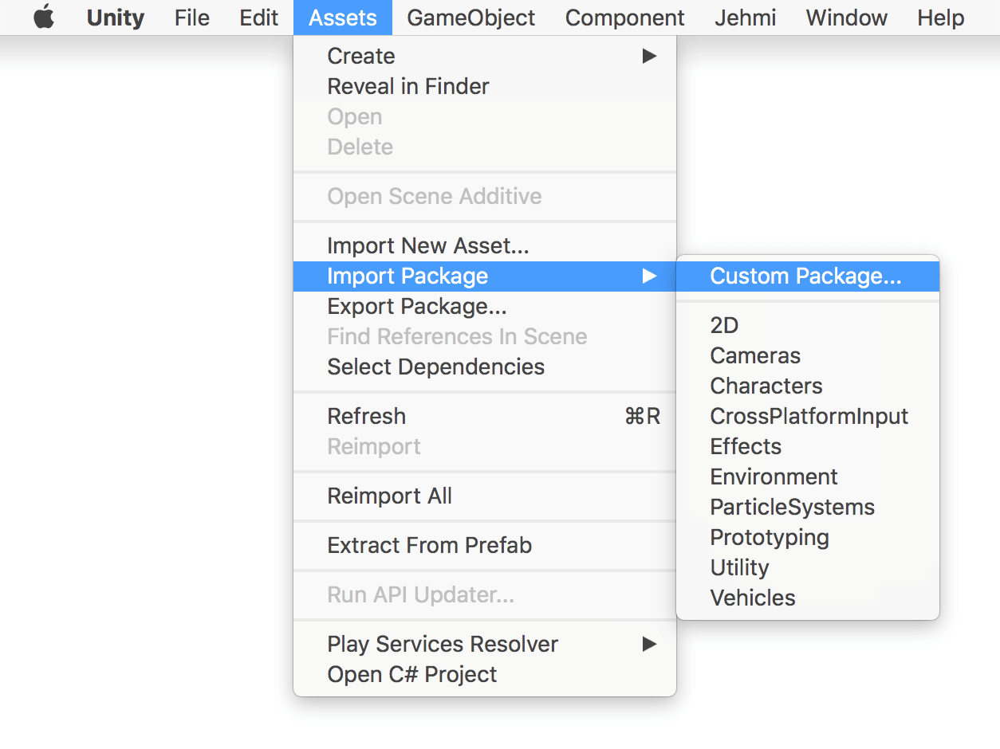
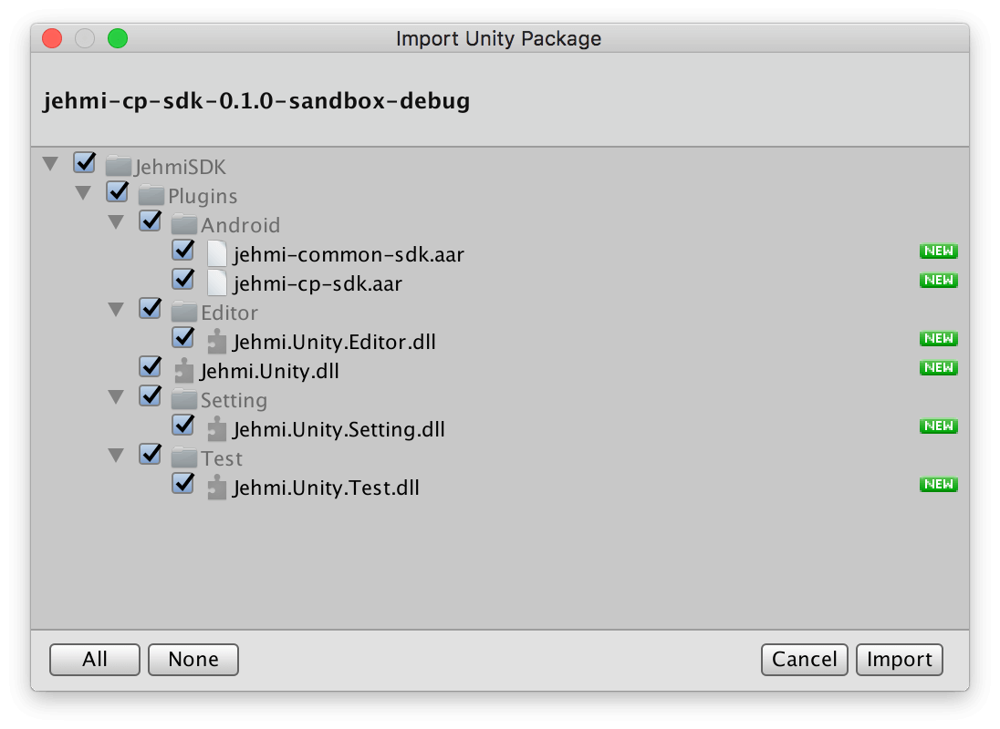
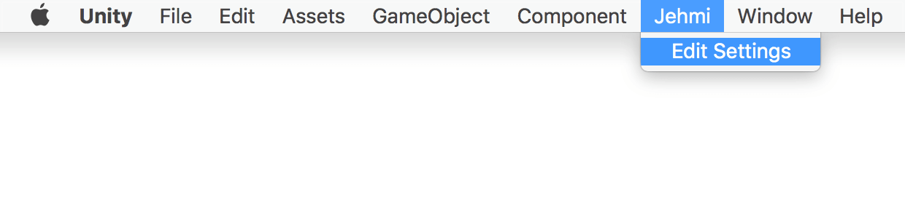
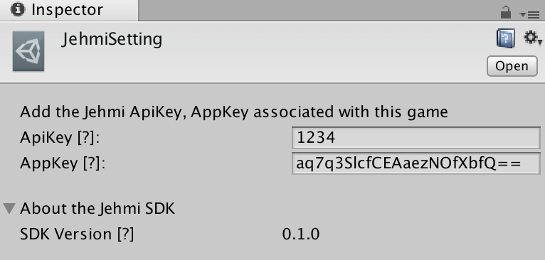
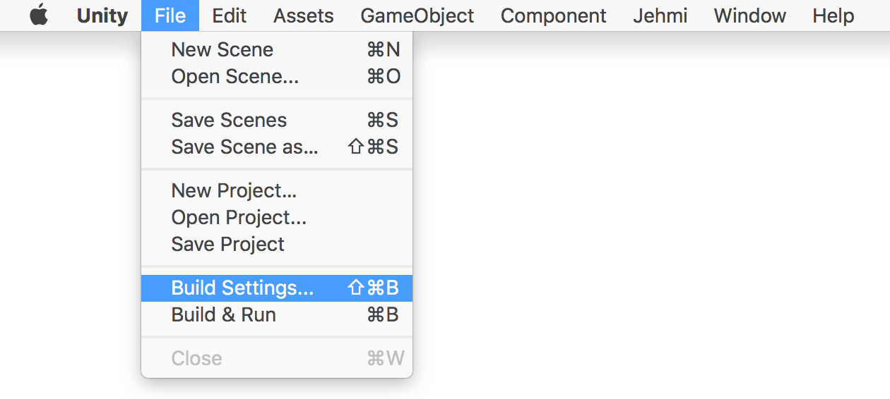
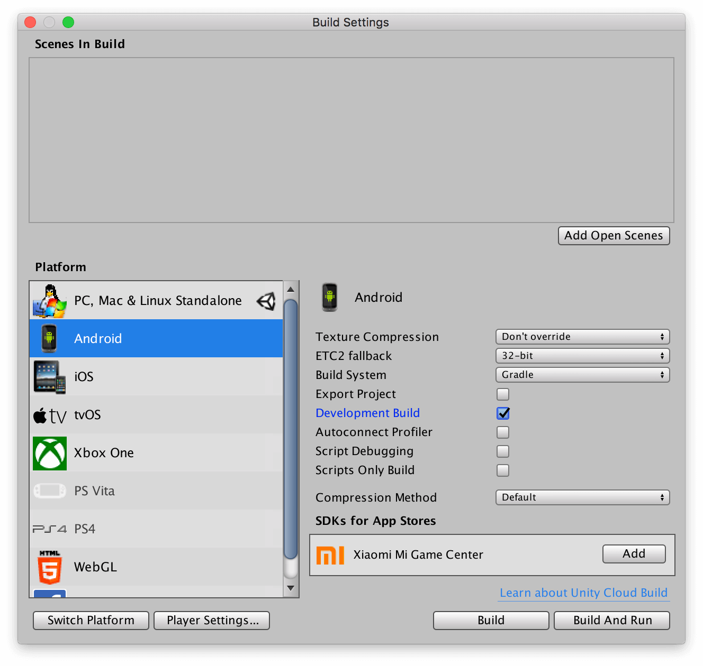
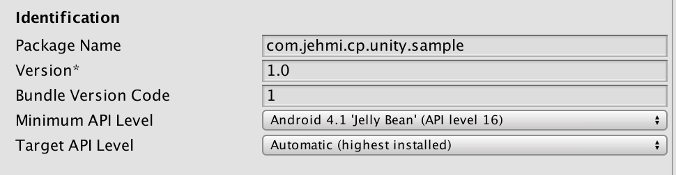
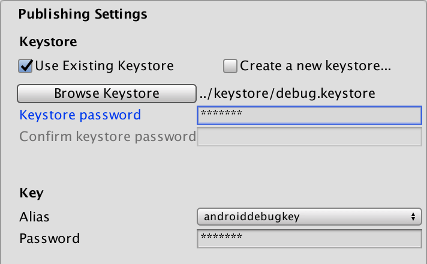
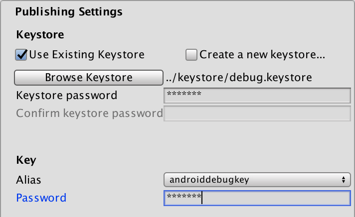

# cp-unity
Unity 용 샘플 입니다.

## 개요
* Jehmi Content Platform (이하 JCP)에서 제공하는 Tracking, Biiling API에 대한 기술가이드이다.
* Unity용 CP SDK는 Unity내부에서 호출 가능하도록 ScriptableObject를 제공한다.


### Getting Started Jehmi for Unity
Step1. 유니티 에디터를 통해 프로젝트 생성합니다.



Step2. 유니티용 Jehmi SDK Package를 다운로드 받습니다. [다운로드](../../archive)

Step3. 다운로드 받은 패키지를  Unity Project Assets에 import 합니다.



Step4. 별도의 선택창이 뜨면 전체를 import 합니다. </br>



Step5. 프로젝트를 저장후 메뉴에서 Jehmi 항목을 열어서 Jehmi ADMIN에서 발급받은 AppKey와 ApiKey를 등록합니다.





Step6. 플랫폼 설정 [File > Build Settings]을 Android 로 설정합니다.



Android Device에서 실행하기 위해 왼쪽하단의 Switch Platform 버튼을 눌러 Android platform으로 변경을 합니다.



Step7. Step6의 화면에서 Player Settings을 클릭한 후 Other Settings 카테고리에서 앱의 Bundle Identifier와 Minimum API Level을 설정합니다.
* Bundle Id : Jehmi ADMIN에서 등록한 앱고유의 ID (Package name 또는 Application Id를 말합니다.)
* Minimum API Level : Android 4.1 'Jelly Bean' (API level 16)


Step8. DownloadApk Api를 이용하기 위해선 Exteral Storage에 대한 접근권한이 필요합니다.


Step9. Keystore password ('android') / Key password ('android')를 입력합니다.




### [API](../../README.md)

#### 유저 등록하기

해당앱 유저 관리에 사용됩니다. 앱 유저 생성 또는 변경 시 호출해야 합니다.

```csharp
using Jehmi.Unity;
public class Main : MonoBehaviour {
    // When user was been Login Completed.
    private void LoginCompleted(string userId) {
        JCP.RegisterUserId(user.userId, new LoginCallback(onSuccessRegisterUserId, onError));
    }
 
    private void onError(ErrorResult error)
    {
        JCP.ShowToast("-- onError : " + error.Message());
    }
 
    private void onSuccessRegisterUserId()
    {
        JCP.ShowToast("++ onSuccess RegisterUserId");
        Debug.Log("++ OnSuccess");
    }
}
```

#### 결제 요청하기

```csharp
using Jehmi.Unity;
public class Main : MonoBehaviour {
    // When user is need to payment.
    void Purchase(
        string hashData,
        string jehmiAuthToken,
        string transactionId,
        string userId,
        string amount,
        string country,
        string currency,
        string itemId,
        string itemName,
        string language = null,
        string timeZone = null,
        string backUrl = null) {
 
        JCP.Purchase(hashData,
                jehmiAuthToken,
                transactionId,
                userId,
                amount,
                country,
                currency,
                itemId,
                itemName,
                language,
                timeZone,
                backUrl,
                new PurchaseCallback(onSuccess, onPending, onError));
    }
 
    private void onSuccess()
    {
        Debug.Log("++ OnSuccess");
        JCP.ShowToast("++ onSuccess Purchase!");
    }
 
    private void onPending()
    {
        Debug.Log("++ onPending");
        JCP.ShowToast("++ Purchase is get Pending status.");
    }
 
    private void onError(ErrorResult error)
    {
        Debug.Log("++ onError : " + error.Message());
        JCP.ShowToast(error.Message());
    }
}
```

#### 어플리케이션 정보얻기

```csharp
using Jehmi.Unity;
public class Main : MonoBehaviour {
    private void GetAppInfo() {
        JCP.GetAppInfo(new ResultCallback<AppInfo>(onSuccess, onError));
    }
    private void onSuccess(AppInfo appInfo)
    {
        Debug.Log("++ OnSuccess : " + appInfo);
    }
 
    private void onError(ErrorResult error)
    {
        Debug.Log("++ onError : " + error.Message());
    }
}
```

#### 어플리케이션 다운로드

```csharp
using Jehmi.Unity;
public class Main : MonoBehaviour {
    public void Start()
    {
        JCP.GetAppInfo(new ResultCallback<AppInfo>(onSuccess, onError));
    }
 
    private void CheckAndDownloadApk(int currentVersionCode, int lastestVersionCode) {
        if (currentVersionCode < lastestVersionCode)
        {
            string title = "Unity Sample App";
            string description = "Update new Application";
            JCP.DownloadApk(title, description, false, new ErrorCallback(onErrorDelegate: onError));
        }
    }
 
    private void onSuccess(AppInfo appInfo)
    {
        Debug.Log("++ OnSuccess : " + appInfo);
        int currentVersionCode = 1; // your current version code
        int lastestVersionCode = appInfo.apkVersionCode;
        CheckAndDownloadApk(currentVersionCode, lastestVersionCode);
    }
 
    private void onError(ErrorResult error)
    {
        Debug.Log("++ onError : " + error.Message());
    }
}
```

#### ErrorCode
ErrorResult 의 code 는 아래와 같습니다.

| Name              | Value | Description     |
| :---------------- |:-----:| :-------------- |
| UNKNOWN_ERROR     | -700  | 알 수 없는 에러    |
| PERMISSION_DENIED | -701  | 퍼미션 없음        |
| HTTP_ERROR        | -702  | http status 에러 |
| PURCHASE_FAILURE  | -703  | 결제실패          |
| NETWORK_ERROR     | -704  | 네트워크 연결실패   |
| INVALID_PARAMS    | -705  | 잘못된 파라미터     |
