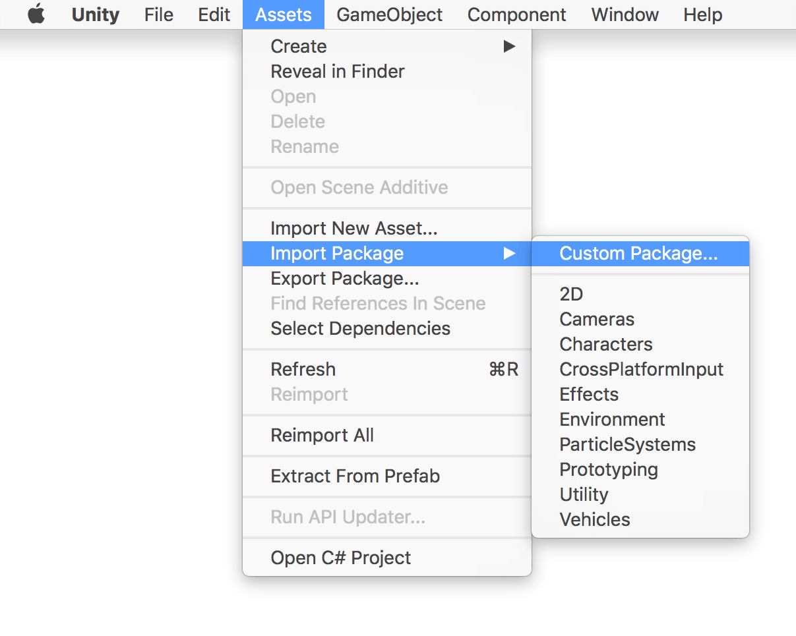
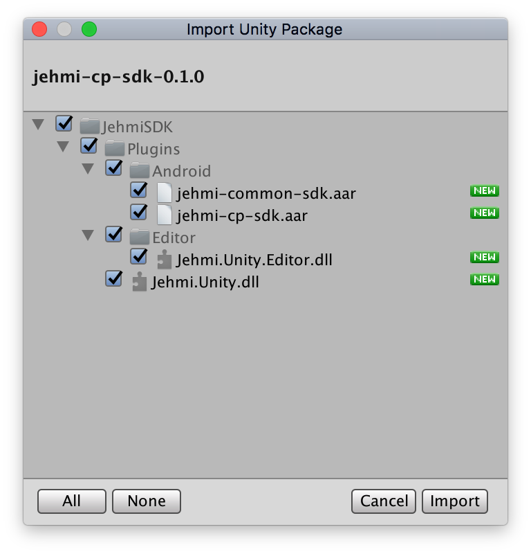
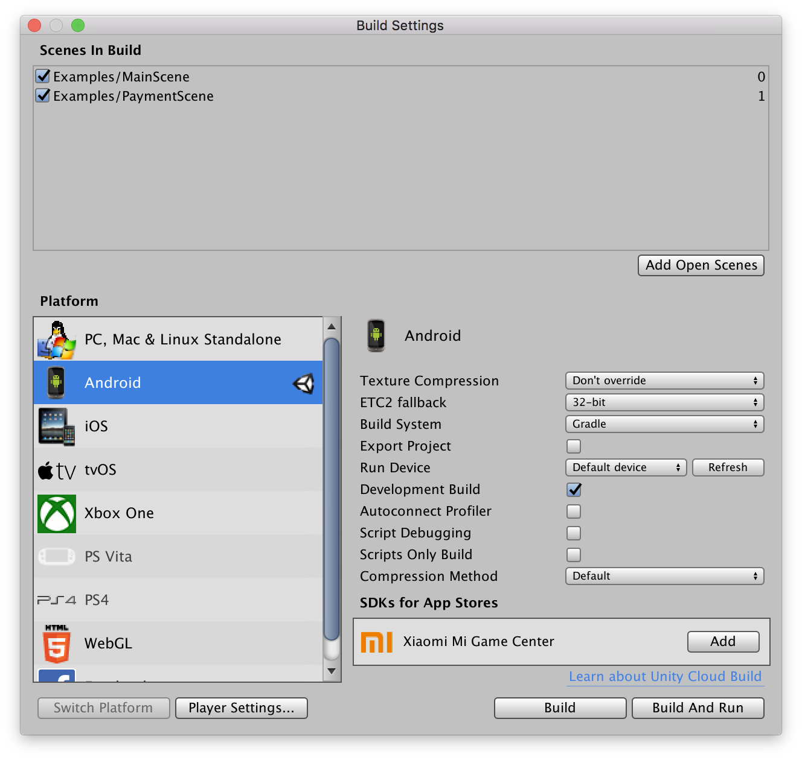
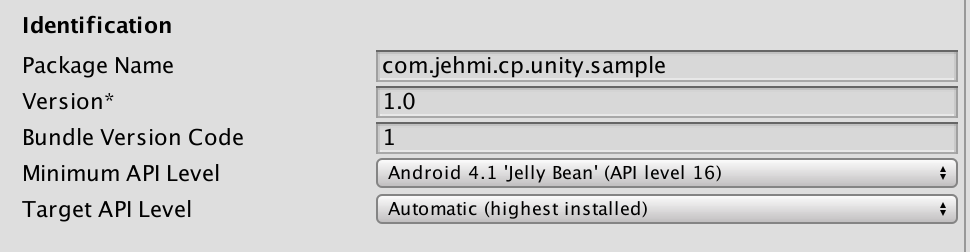

# Unity CP SDK 설정 가이드
* CP API를 사용하기 위한 Unity SDK 설정방법입니다.

#### 요구사항
* Minimum Unity Version : 5.0.0
* Minimum Android Version : Android 4.1 'Jelly Bean' (API level 16)

#### Step 1. Unity Editor를 이용하여 프로젝트를 생성합니다.

#### Step 2. Unity SDK 다운로드
* Admin에서 제공중인 Unity용 SDK를 다운 받습니다.
#### Step 3. Unity 를 실행 한 후에 방금 다운로드한 Unity SDK를 Import 합니다.
 
#### Step 4. 별도의 선택창이 뜨면 전체를 import 합니다.

#### Step 5. 구성파일 다운로드 및 설정
* 다운 받은 `jehmi-cp-services.json` 을 `Assets` 에 추가합니다. 
#### Step 6. 플랫폼 설정 [File > Build Settings]을 Android 로 설정합니다.

* Android Device에서 실행하기 위해 왼쪽하단의 Switch Platform 버튼을 눌러 Android platform으로 변경을 합니다.

#### Step 7. Step6의 화면에서 Player Settings을 클릭한 후 Other Settings 카테고리에서 앱의 Bundle Identifier와 Minimum API Level을 설정합니다.
* Bundle Id : Jehmi ADMIN에서 등록한 앱고유의 ID (Package name 또는 Application Id를 말합니다.)
* Minimum API Level : Android 4.1 'Jelly Bean' (API level 16) 이상의 버전으로 등록합니다.

#### Step8. DownloadApk Api를 이용하기 위해선 Exteral Storage에 대한 접근권한이 필요합니다.

